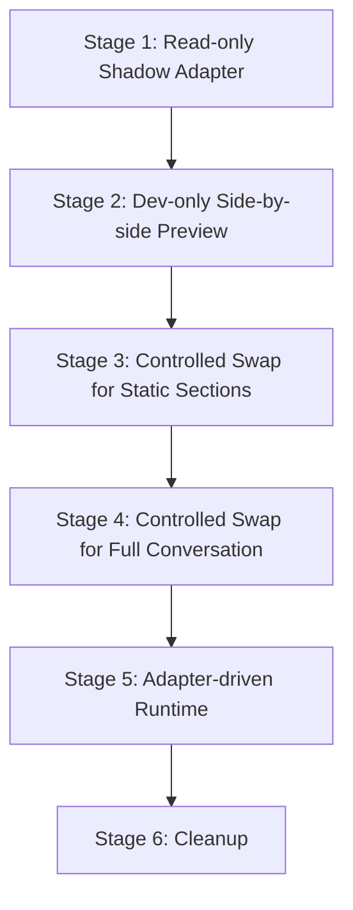

# Controlled Runtime Integration Architecture

Este documento establece la arquitectura y estrategia de integración controlada entre el flujo de negocio real de **Carga Histórica de Encuestas** (`ConversationalImportWorkspace`), el **Historical Import Flow Adapter** y el **Chat Foundation**.

El objetivo es definir un camino progresivo, reversible y seguro para migrar la interfaz conversacional del flujo real hacia el motor de renderizado y políticas de **Chat Foundation** sin alterar el comportamiento productivo validado en el puerto `5173`.

---

## 1. Propósito

Esta arquitectura define cómo integrar progresivamente el flujo real de Carga Histórica con Chat Foundation a través del Flow Adapter, sin romper el flujo aprobado en `5173`.

Establece las siguientes relaciones y responsabilidades clave:
* **`CURRENT_WORKSPACE` (ConversationalImportWorkspace)**: Es la fuente de runtime actual del dominio de Carga Histórica. Controla la lógica de negocio, mantiene el estado de la importación y coordina el flujo.
* **`CHAT_FOUNDATION`**: Actúa como el motor de renderizado visual base (message renderer, bubbles) y de políticas conversacionales básicas (avatar, thinking behavior, common alerts).
* **`FLOW_ADAPTER`**: Es la capa traductora pura e intermedia que transforma el estado de negocio del wizard en mensajes (`ChatFoundationMessage`), acciones sugeridas (`ChatFoundationAction`) y entradas esperadas (`ChatFoundationExpectedInput`).
* **`CONTROLLED_INTEGRATION`**: Una estrategia de migración por etapas graduales, reversibles y verificables mediante feature gates.

---

## 2. Principios de integración

Para asegurar la estabilidad del producto y mitigar riesgos operativos:
* **No reescrituras masivas**: No reescribir `ConversationalImportWorkspace` de forma completa en una sola fase.
* **Paridad primero**: No reemplazar el flujo real o su renderizado en producción hasta tener paridad visual y funcional absoluta.
* **Integración por capas**: Integrar el adapter y el chat foundation en capas pequeñas y autocontenidas.
* **Rollback simple**: La integración debe ser fácil de desactivar o revertir de manera inmediata (ej. mediante una única constante lógica/Feature Gate).
* **Flujo productivo intacto**: Mantener el puerto `5173` (flujo real existente de Carga Histórica) funcionando sin alteraciones durante toda la migración.
* **Playground de validación**: Mantener el puerto `5174` como playground de validación visual e interactiva.
* **Sin importación real**: No realizar conexiones de importación real en la base de datos o APIs productivas en estas fases de integración UI.
* **Sin dashboard ni comparativos**: No crear tableros de control (dashboards) ni vistas comparativas de encuestas fuera de los límites de esta fase.

---

## 3. Estado actual del sistema

A la fecha, los siguientes componentes se encuentran listos, aprobados y aislados:
* **Chat Foundation Visual**: Componentes base de renderizado visual de mensajes aprobados.
* **Message Renderer**: Soporta múltiples tipos de mensajes como texto plano, estructurados, advertencias, confirmaciones y detalles seguros.
* **Thinking Behavior**: Políticas y componentes para visualizar el estado "pensando" del agente definidos y probados de forma pura.
* **Conversation Policy**: Políticas de conversación genéricas (seguridad, ayuda, no entendido) implementadas.
* **Flow Adapter Architecture**: Arquitectura del adaptador documentada y aprobada.
* **Flow Adapter Types**: Tipos TypeScript y contratos definidos y exportados.
* **Flow Adapter Message Mapper**: Mapeador puro implementado para traducir estados de wizard en mensajes de Chat Foundation.
* **Adapter Fixture**: Escenarios simulados y datos de prueba visualizados con éxito en el playground (`5174`).
* **Flujo Real**: Sigue ejecutándose intacto dentro de `ConversationalImportWorkspace.tsx` con su UI original.

---

## 4. Boundary de runtime (Límites de Ejecución)

Definimos límites rígidos de responsabilidad para cada capa de software:

### ConversationalImportWorkspace
* **Mantiene el estado actual**: Sigue controlando el estado funcional e interactivo de la importación (scope, configuraciones, matching, etc.).
* **Controla el input actual**: Captura los eventos de entrada del usuario de manera directa.
* **Conserva el flujo funcional existente**: Mantiene los triggers de lógica internos para transicionar entre pasos.
* **Sin fugas de estilos**: No debe absorber ni copiar estilos locales del Chat Foundation de manera manual o ad-hoc.

### Flow Adapter
* **Entradas y Salidas puras**: Recibe el estado actual del wizard o un snapshot derivado de este y produce mensajes, acciones y entradas esperadas.
* **Sin Side Effects**: No ejecuta peticiones HTTP, no interactúa con el DOM, no escribe en bases de datos y no lanza timers.
* **Sin modificación de estado global**: No muta el estado global de la aplicación ni del workspace.
* **Sin UI**: No renderiza elementos HTML ni JSX directamente; solo emite estructuras de datos descriptivas.

### Chat Foundation
* **Renderizador puro**: Renderiza la lista de mensajes pasados de forma visual según su tipo.
* **Aplica estilos y temas**: Controla la visualización del avatar (gradiente sin icono interno), spacing, burbujas y tipografía.
* **Representa estados del agente**: Muestra la burbuja de "pensando" (thinking state) de manera visual.
* **Agnóstico al negocio**: No tiene conocimiento de reglas específicas de encuestas, ciclos, XLSX ni del negocio de clima organizacional.

---

## 5. Estrategia de integración propuesta

La migración se realizará de forma estructurada a través de las siguientes fases o etapas:



### Stage 1 · Read-only Shadow Adapter
* El workspace real (`ConversationalImportWorkspace`) sigue renderizando la UI actual al usuario.
* Se calcula el snapshot del adaptador en paralelo en memoria utilizando el estado real del componente.
* Los mensajes producidos no se muestran en la UI productiva.
* **Propósito**: Validar que la compilación, la importación de tipos y la generación de snapshots no rompa la consola ni introduzca errores silenciosos.

### Stage 2 · Dev-only Side-by-side Preview
* Solo se activa bajo el contexto de desarrollo/playground o mediante un parámetro interno.
* Se renderizan en paralelo (lado a lado) la UI de mensajes clásica y la UI generada por Chat Foundation a partir del adapter real.
* **Propósito**: Comparar visualmente la consistencia del texto, advertencias, resúmenes y tipos de mensajes generados con el flujo productivo tradicional.

### Stage 3 · Controlled Renderer Swap for Static Sections
* Se sustituye el renderizado manual de pasos estáticos específicos del chat actual (por ejemplo, el mensaje de bienvenida y confirmación de archivos) por la burbuja del `ChatFoundationMessageRenderer`.
* El input del usuario y las transiciones lógicas siguen siendo controladas por la lógica cableada del workspace original.
* **Propósito**: Empezar a transferir control de renderizado de burbujas en pasos no críticos y de baja interacción.

### Stage 4 · Controlled Renderer Swap for Full Conversation
* El `ChatFoundationMessageRenderer` pasa a renderizar el historial de conversación completo del flujo.
* El workspace del importador sigue manteniendo el estado principal y las variables del wizard.
* **Propósito**: Lograr paridad visual completa en la visualización de la conversación de importación.

### Stage 5 · Adapter-driven Runtime
* El Flow Adapter se convierte en la fuente principal de verdad de la conversación para la UI.
* Las entradas de texto y comandos del compositor son normalizados por el Chat Foundation y enviados al Flow Adapter, el cual notifica al Workspace el comando correspondiente de negocio.
* El workspace actúa únicamente como orquestador del dominio y estado lógico de importación.

### Stage 6 · Cleanup
* Remoción del código de renderizado y lógica de mensajes duplicada en `ConversationalImportWorkspace`.
* Mantener la separación limpia y estable de adapters, negocio y UI genérica.

---

## 6. Feature gate / integration gate

Para controlar la activación de la integración de runtime se define una compuerta de integración conceptual:

```typescript
const HISTORICAL_IMPORT_CHAT_FOUNDATION_RUNTIME_ENABLED = false;
```

### Reglas del Feature Gate:
1. **Default en `false`**: Debe estar apagado por defecto para garantizar que el flujo real en el puerto `5173` permanezca 100% inalterado.
2. **Sin efectos secundarios en el cliente**: No debe depender de variables del `localStorage`, `sessionStorage` o cookies que puedan ser alteradas de manera no controlada en producción.
3. **Sin query params productivos**: No depender de query params para activarse en entornos de producción del cliente.
4. **Sin rutas adicionales**: No debe crear ni exponer nuevas rutas en el router de producción.
5. **Contexto de Dev**: Podrá ser habilitado explícitamente en el entorno de playground o archivos de desarrollo locales para propósitos de QA.

---

## 7. Criterios de paridad antes de swap

Antes de activar el reemplazo de cualquier renderizador de mensajes real por el Chat Foundation, se debe verificar que:
* **Scope selection**: La visualización del alcance de la encuesta detectada sea idéntica en información y opciones funcionales.
* **General configuration**: Los campos y resúmenes de nombre, tipo, visibilidad, fecha fin y umbral de confidencialidad sean claros y legibles.
* **Match review**: El desglose estructurado del emparejamiento de preguntas, dimensiones, segmentos y demográficos conserve la jerarquía y legibilidad sin exponer datos sensibles.
* **Thinking behavior**: El estado de procesamiento visual ("pensando") se muestre antes de las respuestas del asistente.
* **Avatar y spacing**: El avatar sea un gradiente consistente sin iconos decorativos adicionales y el espaciado vertical respete la UI aprobada de Carga Histórica.
* **Privacidad de datos**: Los detalles técnicos (`safe_details`) se muestren limpios de información sensible (sin PII, filas de datos reales o volcados de datos internos).
* **Mensajes semánticos**: Los warnings y errores aparezcan con la semántica visual y el icono adecuado sólo bajo las condiciones del negocio.
* **Navegación e inputs**: El flujo y control de texto continúe operando normalmente sin interrupciones.
* **Restricción de botones**: No existan botones de acción que permitan el salto de etapas lógicas sin validación o que no pertenezcan al diseño conversacional puro.
* **Sin componentes ajenos**: No se incluyan paneles laterales de edición (side-panel editor), visualizaciones de dashboards o comparativos de encuestas.

---

## 8. Riesgos y mitigaciones

| Riesgo | Impacto | Mitigación |
| :--- | :--- | :--- |
| **Romper el flujo de producción (`5173`)** | Crítico | Mantener el Feature Gate en `false` por defecto e integrar cambios progresivamente en ramas aisladas. |
| **Duplicación de lógica de mensajes** | Medio | Utilizar el `historicalImportFlowAdapterMessageMapper` como único generador de mensajes y evitar mapeos inline en el componente. |
| **Mezcla de estilos CSS** | Alto | Mantener los estilos de Chat Foundation aislados. No aplicar selectores del chat base al contenedor del Workspace de forma directa. |
| **Inconsistencias conversacionales** | Medio | Someter cada cambio visual a QA visual humano mediante el playground en `5174`. |
| **Exposición accidental de PII** | Crítico | Sanitización en el adaptador. El adaptador no recibe datos crudos, solo metadatos y sumarios calculados por el dominio. |
| **Saturación visual de iconos** | Bajo | Restringir el uso de iconos a estados estrictamente semánticos (errores, advertencias, información). |

---

## 9. Archivos que podrían modificarse en fases futuras

### Allowed future runtime files (Archivos de runtime permitidos para integración)
* `src/features/historical-import/conversational-import/ConversationalImportWorkspace.tsx` (Para inyectar el Feature Gate y el renderizador shadow/condicional).
* `src/features/historical-import/conversational-import/flow-adapter/**` (Mejoras y ajustes en los mappers e intérpretes si son requeridos).
* `src/features/historical-import/conversational-import/chat-foundation/**` (Correcciones de bugs visuales o de estilos específicos descubiertos).

### Forbidden unless decision gate (Prohibido modificar salvo autorización expresa)
* `src/App.tsx`
* `package.json` / `package-lock.json`
* `src/components/ui/**` (Evitar cambios en los componentes UI genéricos globales).
* `src/features/historical-import/demo-fixture/**`
* `src/features/historical-import/dashboard/**`

---

## 10. Plan de fases futuras

El roadmap de integración y estabilización se compone de los siguientes pasos consecutivos:

1. **`11D-H44-H14 · Controlled Runtime Integration Build`**
   * Implementación de la integración en paralelo (Stage 1 y Stage 2) bajo el feature gate desactivado por defecto.
   * La integración debe ser mínima, modular y reversible.
2. **`11D-H44-H15 · Historical Import Flow Visual Regression QA`**
   * Auditoría visual de regresión sobre el flujo real y el playground.
3. **`11D-H44-H16 · Runtime Integration Hotfix`** (si aplica)
   * Resolución de cualquier discrepancia o bug detectado en la fase de QA.
4. **`11D-H44-H17 · Chat Foundation Runtime Stabilization`**
   * Estabilización final de tipos y renderizado en producción.
5. **`11D-H45 · Ambiguity Resolution Flow`**
   * Implementación del sub-flujo conversacional para resolver discrepancias en el match estructural de encuestas.

---

## 11. Criterios para la fase H44-H14 (Build)

La próxima fase de construcción (`H44-H14`) deberá regirse por los siguientes límites estrictos:
* **No sustituir**: No reemplazar la lógica ni los componentes de renderizado de `ConversationalImportWorkspace` de una vez.
* **No reescribir**: El flujo lógico actual de transiciones y la máquina de estados del wizard de negocio deben permanecer intactos.
* **No alterar datos**: No modificar los modelos de datos de importación.
* **No cambiar imports**: No realizar refactorizaciones masivas de archivos de importación.
* **No modificar el núcleo**: No alterar el core del Chat Foundation a menos que sea un bug de compatibilidad crítico.
* **No crear rutas**: No añadir nuevas URL ni redirecciones de navegación.
* **No realizar importación real**: Mantener la simulación de sandbox como límite de finalización del flujo conversacional.
* **No crear dashboards**: Mantener fuera del alcance la sección de analíticas o dashboards comparativos.
* **Mantener 5173 funcional**: Garantizar que la suite actual de carga histórica siga operando de manera idéntica.
* **Validación visual obligatoria**: Cada avance debe validarse mediante QA visual humano en el playground.

---

## 12. Límites explícitos de la fase H44-H13

Para esta fase de documentación arquitectónica de integración:
```text
NO_SRC_CHANGES_IN_H44_H13 = YES
NO_RUNTIME_INTEGRATION_IN_H44_H13 = YES
NO_UI_CHANGES_IN_H44_H13 = YES
NO_FLOW_MIGRATION_IN_H44_H13 = YES
NO_IMPORT_EXECUTION = YES
NO_SANDBOX_IMPORT_RUNTIME = YES
NO_RESULT_LINK_CREATED = YES
NO_DASHBOARD_OR_COMPARISON_CHANGES = YES
READY_FOR_COMPARISON_OUTPUT_DISABLED = YES
```
