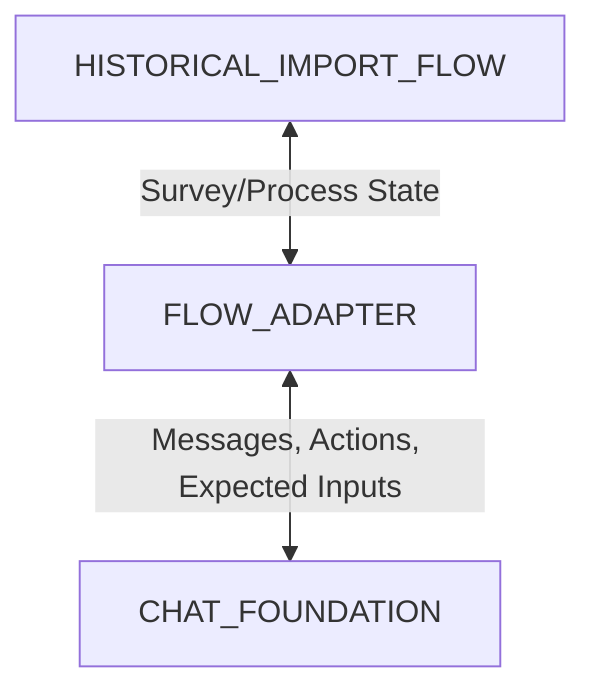

# Historical Import Flow Adapter Architecture

Este documento establece la arquitectura del adaptador para conectar el flujo de **Carga Histórica de Encuestas** con el **Chat Foundation** (componente base reutilizable).

## 1. Propósito del Adapter
El **Flow Adapter** actúa como una capa de desacoplamiento (traducción y mediación) entre el flujo de negocio específico de la carga histórica y el motor base del Chat Foundation. Su propósito principal es permitir que el flujo de negocio evolucione de forma independiente a la interfaz y políticas del chat base, garantizando que el Chat Foundation permanezca 100% reutilizable y libre de dependencias específicas del dominio de encuestas.

## 2. Principio de Separación (Contrato de Separación)
Establecemos la separación estricta en tres capas conceptuales:
* **CHAT_FOUNDATION**: Componente base de interfaz de usuario y políticas de chat comunes. No tiene conocimiento alguno del negocio de encuestas.
* **HISTORICAL_IMPORT_FLOW**: Flujo de negocio específico que gestiona el estado, procesamiento, validaciones y datos de la importación de encuestas históricas.
* **FLOW_ADAPTER**: Capa de traducción que recibe eventos del flujo de negocio y los transforma en mensajes, acciones y entradas esperadas comprensibles por el Chat Foundation, así como normaliza los intents del usuario de vuelta hacia el flujo de negocio.

## 3. Responsabilidades del Chat Foundation
El Chat Foundation es responsable exclusivamente de:
- Mantener y renderizar el Shell del Chat (`ChatShell`), burbujas de mensaje (`ChatFoundationMessageBubble`) y el compositor de entrada (`MessageComposer`).
- Ejecutar el renderizado visual de mensajes según su tipo (`plain_text`, `structured`, `confirmation`, `warning`, `error`, `safe_details`, `thinking`, `handoff`).
- Controlar y mostrar de forma consistente el indicador de pensando (`ThinkingBehavior`) antes de emitir cualquier respuesta del asistente.
- Aplicar políticas conversacionales comunes a nivel de chat (`ConversationPolicy`), como entradas no entendidas o solicitudes de ayuda del sistema general.
- Normalizar intenciones básicas como confirmaciones de texto o selección de números (`IntentNormalization`).
- Aplicar políticas básicas de seguridad (`SafetyResponsePolicy`) ante abusos generales del chat.

**Límite estricto**: Chat Foundation **no sabe** de encuestas, ciclos de clima, archivos Excel/XLSX, dimensiones, preguntas, segmentos, mapeos ni el proceso técnico de importación.

## 4. Responsabilidades del Historical Import Flow
El flujo de importación histórica es responsable exclusivamente de:
- Validar técnicamente los archivos cargados (XLSX, CSV).
- Detectar el alcance de la encuesta, nombre, ciclos y metadatos del archivo.
- Calcular y almacenar el mapeo estructural (preguntas, dimensiones, escalas, segmentos).
- Ejecutar el motor de coincidencia estructural (Matching Engine).
- Validar umbrales mínimos de confidencialidad y metadatos de configuración general.
- Ejecutar simulaciones de importación en entornos de sandbox.
- Mantener el estado interno de la importación y guardar el borrador listo.

**Límite estricto**: El flujo de negocio **no debe** renderizar burbujas, iconos, estilos, estado de pensando ni políticas conversacionales de chat por su cuenta.

## 5. Responsabilidades del Flow Adapter
El Flow Adapter une ambas capas y es responsable de:
- **Traducción de Estado a Interfaz**: Traducir el estado interno de la importación (por ejemplo, `reviewing_dimensions`) a una especificación de mensajes (`ChatFoundationMessage`), acciones sugeridas (`ChatFoundationAction`) y entradas esperadas (`ChatFoundationExpectedInput`).
- **Normalización de Intents de Negocio**: Traducir las entradas crudas del usuario normalizadas por el Chat Foundation a comandos de negocio específicos (por ejemplo, traducir la selección de la opción "1" a un comando para seleccionar el alcance "QS Clima 2025").
- **Mediación de Seguridad de Dominio**: Verificar que la información técnica detallada que se envía al chat base esté libre de información sensible o PII.

---

## 6. Estados Mínimos del Adapter
El adapter gestionará y mapeará la transición entre los siguientes estados del flujo de negocio:

1. `idle`: Estado inicial de espera antes de la carga de archivos.
2. `files_uploaded`: Confirmación de que se han subido archivos correctamente.
3. `detecting_survey_scope`: Analizando el archivo para identificar si contiene múltiples encuestas o ciclos.
4. `awaiting_survey_scope_selection`: El sistema detectó múltiples alcances y espera que el usuario seleccione uno.
5. `asking_general_configuration`: Solicitando datos de configuración general (nombre, tipo, visibilidad, etc.).
6. `confirming_survey_name`: Validando y confirmando el nombre de la encuesta con el usuario.
7. `confirming_survey_type`: Confirmando si es clima laboral, evaluación 360, etc.
8. `confirming_visibility`: Confirmando si los resultados serán públicos, restringidos o privados.
9. `confirming_survey_end_date`: Validando y confirmando la fecha de fin de la encuesta cargada.
10. `confirming_confidentiality_threshold`: Confirmando el límite mínimo de respuestas para reportar datos (e.g. mínimo 4 respuestas).
11. `confirming_main_file`: Pidiendo confirmación sobre cuál es el archivo principal de respuestas.
12. `confirming_associated_files`: Pidiendo confirmación sobre archivos asociados de metadatos o demográficos.
13. `reviewing_structure_match`: Mostrando el resumen de coincidencia de estructura y esperando aprobación del usuario.
14. `reviewing_questions_and_scales`: Revisión detallada de preguntas y sus escalas asociadas.
15. `reviewing_demographics`: Revisión de las variables demográficas detectadas.
16. `reviewing_participants_or_responses`: Revisión del total de participantes o respuestas mapeadas.
17. `reviewing_dimensions`: Revisión de las dimensiones lógicas de la encuesta.
18. `reviewing_question_dimension_mapping`: Revisión de qué preguntas pertenecen a qué dimensiones.
19. `reviewing_segments`: Revisión de segmentos organizacionales o filtros.
20. `reviewing_privacy`: Confirmación expresa de consentimiento de seguridad y privacidad de los datos.
21. `resolving_ambiguity`: Flujo transversal para resolver conflictos cuando una entrada del usuario no es del todo clara en un paso específico.
22. `structure_approved`: El usuario ha aprobado la estructura completa mapeada.
23. `reviewing_detected_results`: Resumen de los resultados procesados listos para importación.
24. `draft_preview_ready`: Vista previa del borrador completo preparado.
25. `awaiting_import_confirmation`: Petición de confirmación definitiva antes de disparar la importación en el sandbox.
26. `sandbox_import_completed`: Notificación de éxito en la importación simulada (sandbox).
27. `import_cancelled`: Registro de que el flujo fue cancelado a petición del usuario.

---

## 7. Tipos de Mensajes que el Adapter debe Producir
El adapter debe generar mensajes que respeten los contratos definidos en `chatFoundationTypes.ts`:

- **Mensajes de Texto Plano (`plain_text`)**: Preguntas directas, aclaraciones simples.
- **Mensajes Estructurados (`structured`)**: Opciones enumeradas presentadas en texto plano y listas jerárquicas simples (sin markup complejo ni leak de markup).
- **Mensajes de Confirmación (`confirmation`)**: Tarjetas de éxito y resúmenes validados (ej. nombre de la encuesta guardado correctamente).
- **Mensajes de Advertencia (`warning`)**: Alertas ante inconsistencias menores que no detienen el flujo (ej. umbral de confidencialidad inusualmente bajo).
- **Mensajes de Error (`error`)**: Errores fatales (ej. archivo corrupto o inválido) que detienen el paso actual.
- **Mensajes de Detalles Seguros (`safe_details`)**: Bloques de datos estructurales sanitizados (sin filas de datos crudos ni PII) formateados de forma segura con un icono de información semántico.
- **Mensajes de Pensando (`thinking`)**: Estados de análisis intermedio para reflejar que el motor está evaluando los datos.
- **Mensajes de Handoff (`handoff`)**: Mensajes de transferencia de control del chat base a un proceso del sistema.

---

## 8. Acciones Contractuales (Contractual Actions)
El adapter interactúa conceptualmente con el flujo mediante acciones predefinidas de negocio (sin botones de UI de negocio):

- `confirm_current_step`: Confirma que el estado actual está verificado.
- `choose_scope`: Selecciona una de las encuestas o ciclos detectados.
- `choose_survey_type`: Selecciona el tipo de encuesta de una lista.
- `choose_visibility`: Selecciona el tipo de visibilidad de la encuesta.
- `provide_survey_name`: Proporciona o modifica el nombre de la encuesta.
- `provide_survey_end_date`: Proporciona o modifica la fecha de finalización.
- `provide_confidentiality_threshold`: Configura el límite de respuestas válidas.
- `confirm_main_file`: Aprueba la asignación del archivo principal.
- `confirm_associated_files`: Aprueba los archivos adicionales cargados.
- `request_details`: Solicita más desglose o información de un paso (e.g. listar preguntas).
- `rename_dimension`: Permite renombrar una dimensión específica.
- `rename_question`: Permite renombrar una pregunta del cuestionario.
- `approve_structure`: Aprobación definitiva de toda la estructura de coincidencia.
- `cancel_import`: Cancela el proceso actual y limpia datos temporales.
- `restart_flow`: Reinicia todo el asistente interactivo de importación.

---

## 9. Expected Inputs por Estado (Expected Inputs Contract)
Para cada estado del flujo, el adapter define un contrato de entrada esperada:

- `awaiting_survey_scope_selection`: `numbered_option` (requiere un número para seleccionar la encuesta).
- `confirming_survey_name`: `free_text` (nombre de encuesta) | `confirmation` (si acepta el sugerido).
- `confirming_survey_type`: `numbered_option` | `exact_text` (selección del tipo).
- `confirming_visibility`: `numbered_option` | `exact_text` (público / restringido / privado).
- `confirming_survey_end_date`: `date` (formato fecha) | `confirmation` (aceptar la extraída).
- `confirming_confidentiality_threshold`: `number` | `confirmation` (aceptar el por defecto).
- `confirming_main_file`: `confirmation` (aprobación sí/no).
- `confirming_associated_files`: `confirmation` (aprobación sí/no).
- `reviewing_*` (todos los estados de revisión): `confirmation` | `request_details` | `cancellation`.
- `resolving_ambiguity`: `numbered_option` | `free_text`.
- `awaiting_import_confirmation`: `confirmation` | `cancellation`.

---

## 10. Intent Normalization Boundary
El adapter recibe del Chat Foundation la intención de usuario normalizada (`ChatFoundationNormalizedIntent`). El adapter es responsable de:
- Traducir `affirm` y `deny` a booleanos de negocio específicos del paso actual.
- Traducir `choose_option` y `extractedValues.optionNumber` al elemento de la lista del dominio que corresponde.
- Mapear `provide_value` y `extractedValues.value` al campo de configuración de negocio en curso (ej. actualizar la propiedad `surveyName`).
- Mapear `cancel` y `restart` a las acciones correspondientes que detienen o reinician la máquina de estado de negocio.

---

## 11. Safety y Privacidad (Safety Policy Boundary)
El Flow Adapter protegerá la aplicación garantizando de forma estricta los siguientes invariantes:
- `NO_PII_VISIBLE = YES`: Ninguna información de identificación personal (nombres, correos, IDs de empleados) debe figurar en los mensajes o detalles del chat.
- `NO_RAW_ROWS_VISIBLE = YES`: Ninguna fila de datos cruda del archivo XLSX/CSV debe enviarse al renderizador de chat.
- `NO_OPEN_TEXT_VISIBLE = YES`: Las respuestas de texto abierto (comentarios de encuesta) no deben listarse ni renderizarse en las burbujas.
- `NO_WORKBOOK_DUMP_VISIBLE = YES`: Está estrictamente prohibido imprimir dumps completos de hojas o libros de Excel.
- `NO_REAL_IMPORT = YES`: La importación real en base de datos productiva está prohibida.

El adapter debe bloquear o redirigir inmediatamente las siguientes categorías de entrada inseguras de dominio:
1. **PII**: Solicitudes para ver correos, nombres o identificaciones de empleados específicos.
2. **raw rows**: Peticiones para mostrar filas individuales de respuestas.
3. **open text**: Comentarios libres de la encuesta histórica.
4. **offensive language**: Uso de términos ofensivos en las instrucciones del usuario.
5. **racist or discriminatory language**: Lenguaje discriminatorio u de odio.
6. **real import without authorization**: Intentos de forzar una importación real directa de base de datos.
7. **api connection without authorization**: Intentos de establecer conexiones externas o de red.
8. **out of scope action**: Comandos o peticiones no relacionados con la carga histórica.

---

## 12. Thinking Behavior Boundary
- El Flow Adapter no maneja timers ni lógica de renderizado del componente de "pensando".
- Indica al Chat Foundation cuándo usar `thinking` definiendo el estado correspondiente en el snapshot.
- Se debe asegurar que procesos largos del dominio (como el análisis inicial de archivos, detección de estructura o cálculo del Matching Engine) gatillen de forma lógica el estado `thinking` en el chat base, asegurando una visibilidad mínima de carga (para evitar flashes molestos de UI).

## 13. Datos y Fixtures Permitidos
- Para testing y desarrollo (en el playground y pruebas locales), el adapter trabajará exclusivamente con estructuras e índices mock de encuestas.
- No se cargará información sensible en caliente. Las fixtures simularán archivos con estructuras realistas pero con datos dummy y anonimizados.

## 14. Relación con el Flujo Actual
El flujo de Carga Histórica existente en `ConversationalImportWorkspace.tsx` se mantiene intacto y operativo bajo el puerto 5173. El desarrollo del adaptador se realizará de forma aislada, sin integrarse al flujo de runtime hasta que la arquitectura del adaptador, tipos y mappers estén validados y aprobados.

## 15. Fases Futuras Propuestas (Roadmap Gradual)
Proponemos las siguientes fases detalladas para la migración controlada sin romper la producción:
1. **Fase 11D-H44-H9 · Historical Import Flow Adapter Types**: Creación de los tipos y contratos TypeScript específicos para el adaptador de carga histórica.
2. **Fase 11D-H44-H10 · Historical Import Flow Adapter Message Mapper**: Desarrollo de la lógica pura que mapea los estados y mappers de coincidencia existentes al formato de mensajes del Chat Foundation.
3. **Fase 11D-H44-H11 · Historical Import Flow Adapter Playground Fixture**: Implementación de mocks y fixtures realistas de carga para simular transiciones completas del adaptador.
4. **Fase 11D-H44-H12 · Adapter Visual QA**: Verificación visual y pruebas del adaptador interactivo en el playground aislado (puerto 5174).
5. **Fase 11D-H44-H13 · Controlled Runtime Integration Architecture**: Diseño detallado para el reemplazo controlado del componente de chat actual en el workspace de producción por el Chat Foundation adaptado.
6. **Fase 11D-H44-H14 · Controlled Runtime Integration Build**: Implementación de la integración en `ConversationalImportWorkspace.tsx` de forma segura.
7. **Fase 11D-H44-H15 · Historical Import Flow Visual Regression QA**: QA exhaustivo de regresión y verificación visual del flujo real final.
8. **Fase 11D-H45 · Ambiguity Resolution Flow**: Implementación fina del flujo interactivo para resolución de términos o mapeos ambiguos.

## 16. Límites Explícitos
- `NO_SRC_CHANGES = YES` en esta fase. No se modifica ningún archivo fuente en `src/`.
- No se realiza integración UI de runtime.
- No se migra el flujo actual ni se introduce comportamiento interactivo en producción.
- No se crea sandbox de importación runtime ni links a resultados.
- La salida de "Listo para comparación" en el dashboard permanece deshabilitada.
- Punto de control visual de UI (`VISIBLE_UI_CHECKPOINT`): **NO** (esta fase es 100% documentación).
